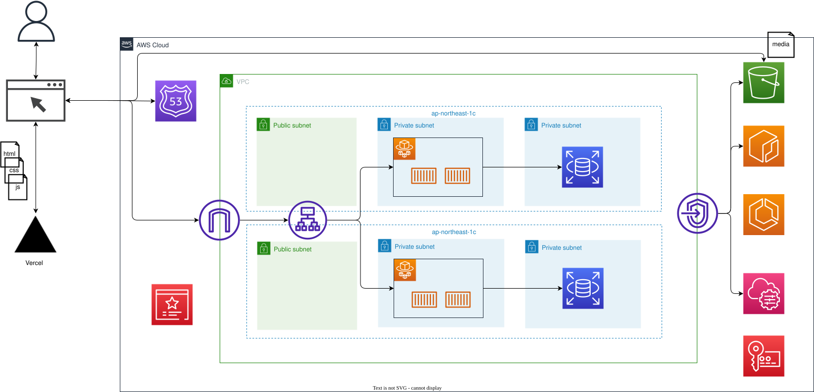
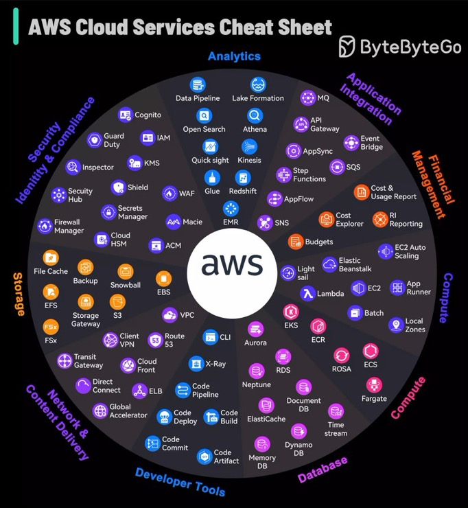

# MeAR Infra

## インフラ構成



### フロントエンド：Vercel

個別のサービスで管理

### バックエンド：AWS

このリポジトリ内で管理

## Terraform ディレクト構成

基本的には下記の Terraform Best Practice に倣って構築している
https://www.terraform-best-practices.com/ja

### Resource module

VPC・EC2・RDS などの各リソースのこと

上位階層から引数を受け取り、受け取った値を元にリソースを構築する。

また、リソースごとの出力値を上位階層に伝播する。

#### 作成方法

- Terraform Registry にある既存のリソースを複製している
  - fork するという手もあり
  - → 別で Git 管理し、Submodule として扱うのも良いかもしれない。

#### まとめ方

- AWS のリソースにはある程度グループが分けすることができるため、下記の画像を参考に分けている



```bash
resource_modules
├── compute
│   ├── ecr
│   └── ecs
│       └── modules
│           ├── cluster
│           ├── container-definition
│           └── service
├── database
│   └── rds
│       └── modules
│           ├── db_instance
│           ├── db_instance_automated_backups_replication
│           ├── db_instance_role_association
│           ├── db_option_group
│           ├── db_parameter_group
│           └── db_subnet_group
├── network
│   ├── alb
│   ├── cloud-front
│   ├── route53
│   └── vpc
│       └── modules
│           └── vpc-endpoints
├── security
│   ├── acm
│   ├── security_group
│   └── ssm-parameter
└── storage
    └── s3
```

### Infra module

リソースモジュールの集まり

構築するシステムの要件によって構成が変わる

#### まとめ方

- VPC や SecurityGroup・Route53 など、ネットワークに関わるモジュールを集合したもの
- ECS や RDS など、アプリの要件を満たすためのモジュールを集合したもの
- その他必要に応じて

といった分類で分けている。

MeAR の構成では、

- Network
- Backend
- Storage

の３つに分けて管理している

```bash
infra_modules
├── backend
├── network
└── storage
```

### Composition module

起点となるモジュール

インフラモジュールの集まりで、分け方としては「開発」「本番」や、リージョンごとの単位でディレクトリを切る

```bash
└─── composition
    └── ap-northeast-1
        ├── dev
        └─── prod
```

`terraform.tfvars` に引数に値を流す事で、下の階層へ伝播され、渡した引数によってリソースが作成される。
